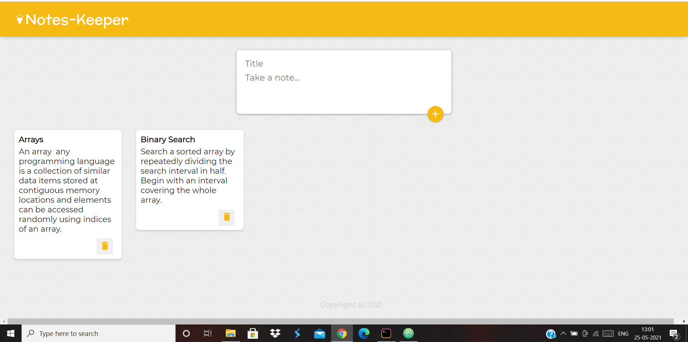
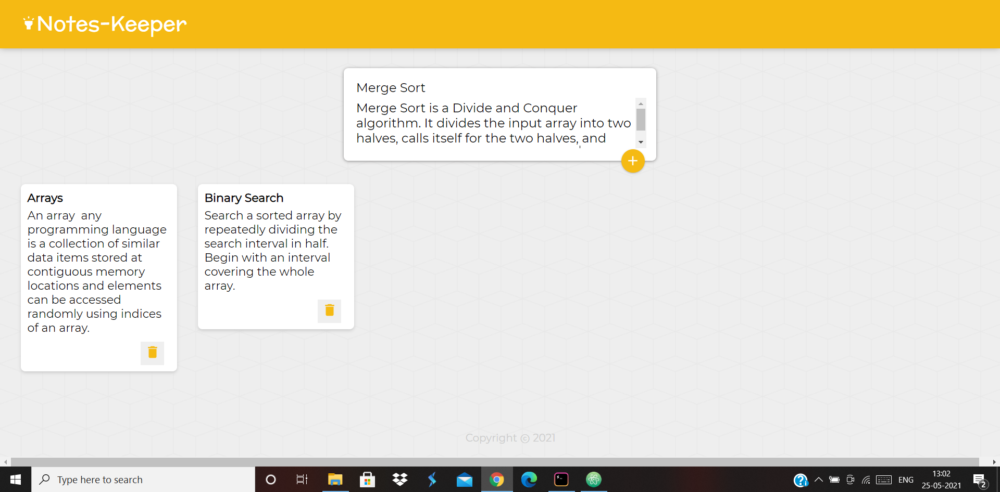
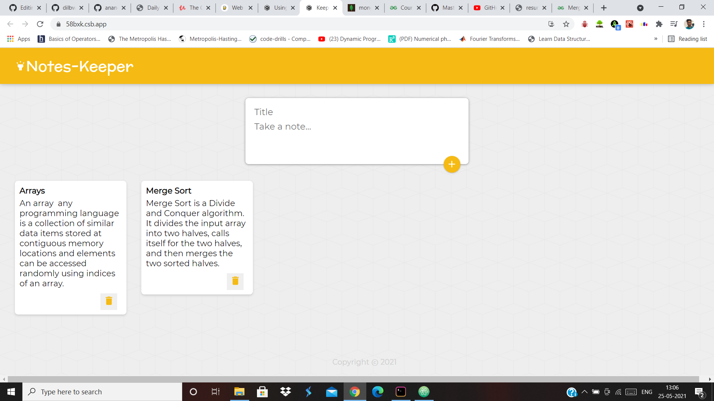

# Notes-Keeper

Notes Keeper App with React Components, Hooks, States, Destructuring, Spread Operator, Material-UI

Initial Page with some already added notes ==> 

Adding another note ==>

After Adding ==>

After Deleting "Binary Search" Note ==>

